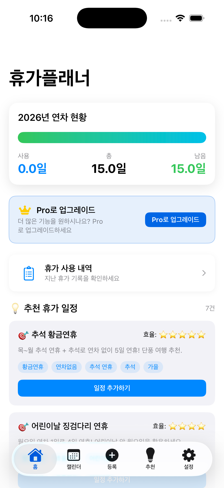
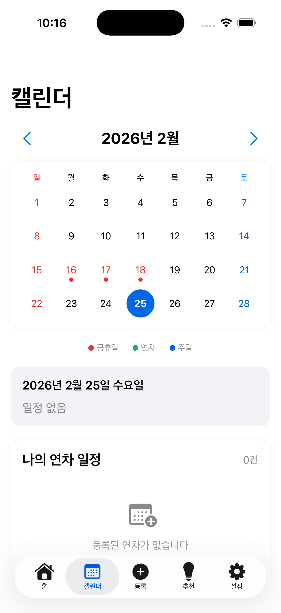
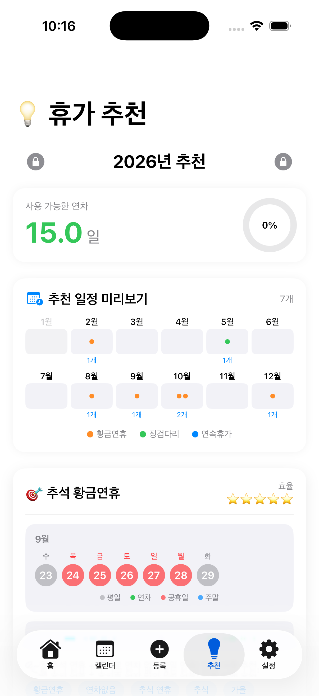
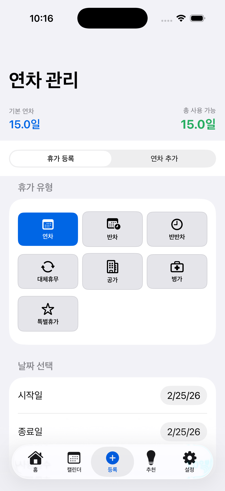

# LeaveWise 📅

  

  <strong>스마트 연차 관리 & 휴가 추천 앱</strong> 
  연차를 똑똑하게 관리하고, 공휴일을 활용한 최적의 휴가 일정을 추천받으세요.

  

  <a href="https://m1zz.github.io/LeaveWise/">🌐 Landing Page</a> •
  <a href="SUPPORT.md">📖 Support</a> •
  <a href="#features">✨ Features</a>

---

## Features

### 📊 연차 관리
- 총 연차, 사용 연차, 남은 연차를 한눈에 확인
- 연차, 반차(오전/오후), 반반차 등 다양한 휴가 유형 지원
- 회사 회계연도에 맞춰 연차 기준월 설정

### ✨ AI 휴가 추천
- 공휴일과 주말을 활용한 최적의 휴가 조합 추천
- 최소 연차로 최대 연휴를 만드는 "황금연휴" 플랜
- 개인 선호도(계절, 기간, 활동) 기반 맞춤 추천

### 🎁 보너스 연차
- 대체휴무, 포상휴가, 리프레시 휴가 등 추가 연차 관리
- 유효기간 설정으로 만료 전 알림

### 📱 홈 위젯
- 앱을 열지 않아도 남은 연차 확인
- 다가오는 휴가 일정 표시

### ☁️ iCloud 백업
- 소중한 연차 기록을 iCloud에 안전하게 백업
- 새 기기에서 간편하게 복원

### 🌏 4개국 지원
- 한국 🇰🇷, 일본 🇯🇵, 중국 🇨🇳, 미국 🇺🇸 공휴일
- 2024~2030년 공휴일 데이터 포함
- 다국어 UI (한국어, English, 日本語, 中文)

---

## Screenshots

| Home | Calendar | Recommendations | Register |
|:----:|:--------:|:---------------:|:--------:|
|  |  |  |  |

---

## Requirements

- iOS 17.0+
- iPhone

---

## Tech Stack

- **SwiftUI** - 선언형 UI
- **SwiftData** - 로컬 데이터 저장
- **WidgetKit** - 홈 화면 위젯
- **StoreKit 2** - 인앱 결제 (Pro 버전)
- **CloudKit** - iCloud 백업

---

## Support

문제가 발생하거나 개선 의견이 있으시면 [SUPPORT.md](SUPPORT.md)를 참고하거나 이메일로 연락해주세요.

📧 support@leavewise.app

---

## Contributing

버그 리포트나 기능 제안은 [Issues](https://github.com/M1zz/LeaveWise/issues)에 남겨주세요!

---

## License

© 2024 LeaveWise. All rights reserved.
